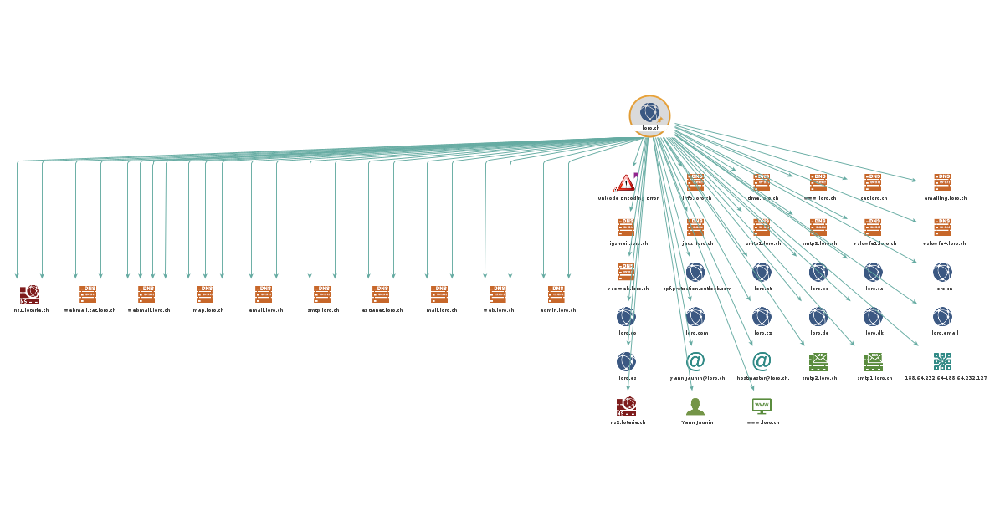
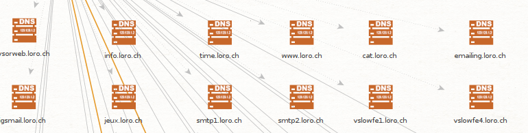
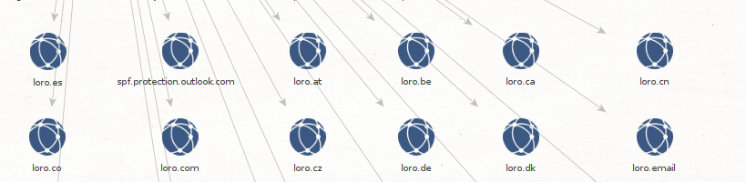
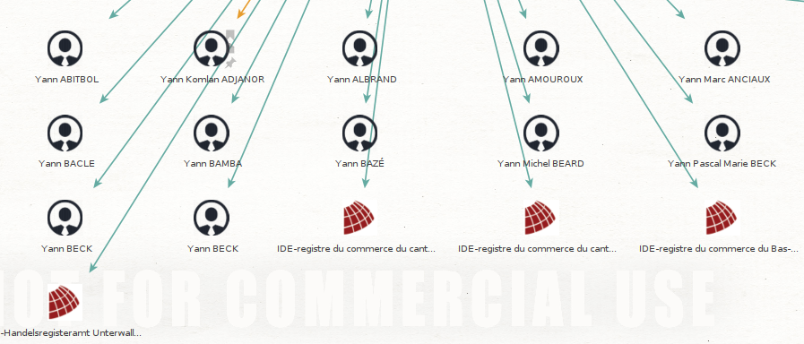
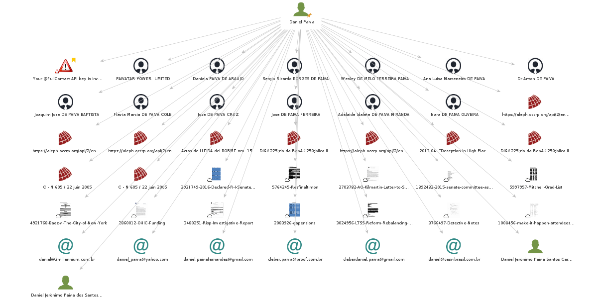

# Maltegeo

## Une simple reconnaissance de réseau

Lors de cette étape, il nous est demandé de récolter toutes les informations d'un nom de domaine.

J'ai choisi la nom de domaine `loro.ch` pour l'exemple car j'ai effectué là-bas mon apprentissage et je connais beaucoup d'informations à propos de l'entreprise.

Voici le résultat de la reconnaissance :

On peut s'apercevoir qu'on récupère plusieurs sous domaines du domaine `loro.ch` et que l'entreprise possède plusieurs domaines ne finisssant pas en `.ch`.

On récupère également le nom d'une personne `Yann Jaunin`. 

Les résultats suivants proviennent de `Yann Jaunin`. Les résultats sont douteux et probablement pas liés à la personne recherchée.

## Recherche d'une identité

Lors de cette partie, il nous est demandé de rechercher une identité. Pour le labo, j'ai pris mon nom et prénom pour les recherches.

On peut s'apercevoir que l'outil à quelques difficultés à récolter des informations pertinentes à mon sujet, mon nom de famille étant assez commun dans la communauté portugaise.

De même pour mes collègues `Nemanja Pantic` et `Edin Mujkanovic`, aucun résultat pertinent n'a pu être récolté.

FAIRE LES PRINTSCREEN

## Recherche d'une adresse email

## Installation et utilisation de nouvelles transformations

#### VirusTotal Public API

#### Shodan Tranform

#### PassiveTotal

## Autres transformations

| Nom de la transformation | Informations disponibles                                     |
| ------------------------ | ------------------------------------------------------------ |
| HaveIBeenPwned           | Recherche de l'adresse email dans la base de données de HaveIBeenPwned. Cela permet de révéler tous les sites compromis dans lesquels l'adresse email est apparue. |
| FullContact              | Il est possible de récupérer des informations d'une personne, nom, domaine, compagnie, lieu et des statistiques de comptes. |
| Dataprovider             | Récupère des informations comme le téléphone, adresse, nom de domaine, IP, email. La liste complète est présente à ce lien https://www.dataprovider.com/assets/docs/dataprovider-transforms.pdf |

